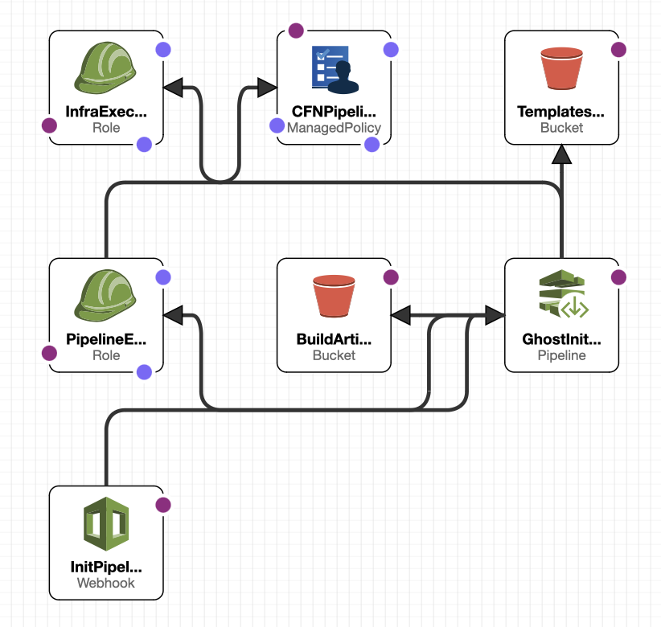

# Ghost on AWS Fargate using CloudFormation 
---


###  Description

---
- [Prerequisites](#Prerequisites)
- [Architecture](#architecture)
    - [Architecture decisions](#architecture-decisions)
    - [Project Folder tree](#project-folder-tree)
    - [Ghost Init all stack](#ghost-init-all-stack)
    - [Infrastructure stack](#infrastructure-stack)
    - [Infrastructure dependecies stack (ALDB)](#infrastructure-dependecies-stack-aldb)
    - [CodeBuildCodePipeline stack (CBCP)](#codebuildcodepipeline-stack-cbcp)
    - [Ghost Fargate deployment](#ghost-fargate-deployment)
    - [Cleanup all Ghost post python serverless fuction](#cleanup-all-ghost-post-python-serverless-fuction)
- [Init Stack parameters](#init-stack-parameters)
- [How to deploy](#how-to-deploy)
- [Recomendations](#recomendations)
- [Next steps to do](#next-steps-to-do)
- [Potential improvements](#potential-improvements)


---

### Prerequisites

Before continuing you will need to ensure you have the following prerequisites:
* DNS hosted zone stored in the AWS Route53 (https://docs.aws.amazon.com/Route53/latest/DeveloperGuide/CreatingHostedZone.html)
* SSL Cerrtificate stored in the AWS Certificate Manager (https://docs.aws.amazon.com/acm/latest/userguide/gs.html)
> Use wiledcard for Multi-environments
* GitHub user token (https://github.com/settings/tokens)

---


### Architecture

#### Architecture decisions:

* Initial read of the Ghost documentation pointed me to the following fact:
Ghost doesn’t support load-balanced clustering or multi-server setups of any description, there should only be one Ghost instance per site. 
Of this fact, the use of AWS CloudFront will be a good solution. Ghost should be deployed using a custom storage adapter to store Images on S3 (Not Implemented)

* In the beginning, I thought of using AWS proton as it provides many benefits. Then I realize that the use of AWS proton might have been overkill for the team as nobody has experience how in using it, and it can take time to learn. 

* The decision was made to use Amazon ECS on AWS Fargate, AWS RDS, and AWS CloudFront integration with AWS S3.

* I've created a separate git repository for the Ghost development to have a Ghost development isolated from the infrastructure development [ghost-development](https://github.com/olektretiak/ghost-development.git) 

* To help with infrastructure development, I've created the Infrastructure CodePipline and one for the Ghost development prespective.


#### Project Folder tree
```
├── ghost-init-all.yaml               - Init Cloudfrmation template
├── cloudformation                    - Environment Nested Stucks 
│   ├── ALBDB.yaml                    
│   ├── CPCB.yaml
│   ├── README.md
│   ├── infrastructire.yaml
│   └── vpc.yaml
├── serverless-go                      - Golang Serverless function 
│   ├── README.md
│   ├── client.go
│   ├── go.mod
│   ├── go.sum
│   ├── main.go
│   └── token.go
└── serverless-python                  - Python Serverless function 
    ├── README.md
    ├── buildspec.yaml
    ├── fn_posts_deleteion.py
    ├── lambda-cleanup-stack.yaml
    └── lamda-build-stack.yaml
```
### Ghost Init all stack

Source: [ghost-init-all.yaml](ghost-init-all.yaml)

Description: Main Ghost project CloudFormation stack

The ghost-init-all CloudFormation stack creates:

1. BuildArtifactsBucket - Stores infrastructure pipeline artifacts. 
2. TemplatesS3Bucket - Stores Ghost project CloudForamtion templates.
3. GhostInitPipeline - Inits CodePipline to rollout and manage the fllowing resources:
    * Lambda Build Stack to build serverless function source.
    * Ghost environments infrastructure if selected for deployment:
        - Development (Default: true)
        - Stage (Default: false)
        - Production (Default: false)
    * Ghost development infrastructure:
        - Webhook - triggers pipeliens on pushed changes in git Ghost develpment repository
        - CodeBuild - builds Ghost docker image. 
        - CodePipeline linked to the git Ghost develpment repository (Creates stages depends on selected environments)
            - Builds Ghost docker image
            - Deploys Ghost Fargete task to development env
            - Deploys to Stage env if approved
            - Deploys to Production env if approved
    * Serverless fuction  to cleanup posts via the Ghost API using Lambda Build Stack output source
4. GhostInitPipeline Polices and roles
5. Admin role to Rollout Infrastructure CloudFormation Stacks


#### Resources:

| Type                         | Logical ID                     |
| :---                         |            ---:                |
| AWS::S3::Bucket              | BuildArtifactsBucket           |
| AWS::IAM::ManagedPolicy      | CFNPipelinePolicy              |
| AWS::CodePipeline::Pipeline  | GhostInitPipeline              |
| AWS::IAM::Role               | InfraExecutionRole             |
| AWS::CodePipeline::Webhook   | InitPipelineWebhook            |
| AWS::IAM::Role               | PipelineExecutionRole          |
| AWS::S3::Bucket              | TemplatesS3Bucket              |

#### Stack Diagram




### Infrastructure stack

Source: [cloudformation/infrastructire.yaml](cloudformation/infrastructire.yaml)

Description: Environment infrastructure Cloudformation stack 


The Infrasttructure CloudFormation stack creates:
* ECS Cluster - Environment ECS cluster 
* VPC stack - Networking
* ALBDB - Deploys RDS, ALB, SG, TG, CloudFront, etc.


#### Resources:

| Type                         | Logical ID                     |
| :---                         |            ---:                |
| AWS::CloudFormation::Stack   | VPCStack                       |
| AWS::ECS::Cluster            | ECSCluster                     |
| AWS::CloudFormation::Stack   | ALBDB                          |


#### Diagram


###  Infrastructure dependecies stack (ALDB)
Description: Infrastructure dependecies stack 
Source: [cloudformation/ALBDB.yaml](cloudformation/ALBDB.yaml)
The ALBDB staks creates:
* RDS secret
* RDS secret kms key
* MySQL RDS instance
* ALB, listeners
* Security groups 
* GhostTargetGroup
* Route53 RecordSetGroup
* CloudFront Distribution if selected

#### Resources:


| Type                         | Logical ID                     |
| :---                         |            ---:                |
| ALBDNS	                   | AWS::Route53::RecordSetGroup   |
| ALBSecurityGroup	           | AWS::EC2::SecurityGroup        |
|DBSecurityGroup 	           | AWS::EC2::SecurityGroup        |
|DBSubnetGroup	               | AWS::RDS::DBSubnetGroup        |
|FargateExecutionPolicy	       | AWS::IAM::Policy               |
|GhostALB	                   | AWS::ElasticLoadBalancingV2::LoadBalancer |
|GhostDB	                   | AWS::RDS::DBInstance           |
||GhostHostSecurityGroup	   | AWS::EC2::SecurityGroup        |
|GhostLogGroup	               | AWS::Logs::LogGroup            |
|GhostTargetGroup	           | AWS::ElasticLoadBalancingV2::TargetGroup|
|HttpsListener	               | AWS::ElasticLoadBalancingV2::Listener |
|Listener	                   | AWS::ElasticLoadBalancingV2::Listener |
|MySQLPasswordParameterStore   | AWS::SSM::Parameter            |
|MySQLSecret	               | AWS::SecretsManager::Secret    |
|MySQLSecretKey	               | AWS::KMS::Key                  |
|MySQLUsernameParameterStore   | AWS::SSM::Parameter            |
|rdskmskey	                   | AWS::KMS::Key                  |
|TaskExecutionRole	           | AWS::IAM::Role                 |
|  TaskRole	                   | AWS::IAM::Role                 |
| GhostCDN                     | AWS::CloudFront::Distribution  |


#### Diagram


### CodeBuildCodePipeline stack (CBCP)
Description: 
Source: Ghost development piplines

#### Resources:

| Type                         | Logical ID                     |
| :---                         |            ---:                |
| AWS::ECR::Repository         | Repository                     |
| AWS::CodePipeline::Webhook   | PipelineWebhook                |
| AWS::IAM::Role               | InstanceRole                   |
| AWS::S3::Bucket              | GhostPipelineBucket            |
| AWS::CodePipeline::Pipeline  | GhostPipeline                  |
| AWS::CodeBuild::Project      | GhostContainerBuildProject     |
| AWS::S3::Bucket              | GhostBuildOutput               |
| AWS::IAM::Role               | CodePipelineServiceRole        |
| AWS::IAM::Policy             | CodePipelineServicePolicy      |
| AWS::IAM::Policy             | CodeBuildServiceRolePolicy	    |
| AWS::IAM::Role               | CloudFormationServiceRole	    |
| AWS::IAM::Policy             | CloudFormationServicePolicy    |
| AWS::EC2::SecurityGroup      | BuildSecurityGroup             |


#### Diagram


### Ghost Fargate deployment

Description: Fargete service and task

Source: Stored in the [Ghost develpment repository](https://github.com/olektretiak/ghost-development/blob/main/pipelines/fargate-deployment.yaml) 

#### Resources:

| Type                         | Logical ID                     |
| :---                         |            ---:                |
| AWS::ECS::TaskDefinition     | GhostService                   |
| AWS::ECS::Service            | GhostService                   |

#### Diagram


### Cleanup all Ghost post python serverless fuction


Serverless fuction to cleanup posts via the Ghost API

###### how to generete Ghost Admin API key

1. Go to the Ghost admin UI -> Settings -> Integrations
2. Add Custom integration 

---

###### Serverless build stack

Source: [lamda-build-stack.yaml](serverless-python/lamda-build-stack.yaml)

The Build stack creates:
* CodeBuild - builds seerverless source
* CRS3Bucket - srores build output artifact
* Lambda fuction - Trigers CodeBuild
* Custom CodeBuildTrigger

###### Diagram


#### Resources
| Type                         | Logical ID                     |
| :---                         |            ---:                |
| AWS::IAM::Policy             | LambdaPolicy                   |
| AWS::IAM::Role               | LambdaExecutionRole            |
| AWS::IAM::Role               | InstanceRole                   |
| AWS::CodeBuild::Project      | ImageBuildProject              |
| AWS::S3::Bucket              | CRS3Bucket                     |
| AWS::IAM::Policy             | CodeBuildServiceRolePolicy     |
| AWS::Lambda::Function        | CodeBuildInitFunction          |
| Custom::CodeBuildTrigger     | CodeBuildInit                  |


#### Serverless Fuction

Source: [lambda-cleanup-stack.yaml](serverless-python/lambda-cleanup-stack.yaml)

---

###### Diagram


###### Resources

| Type                         | Logical ID                             |
| :---                         |            ---:                        |
| AWS::IAM::Role               | GhostCleanAllPostsLambdaExecutionRole  |
| AWS::IAM::Policy             | GhostCleanAllPostsLambdaExecutionPolicy|
| AWS::Lambda::Function        | GhostCleanAllPostsFunction             |


###### Event JSON exmple

```
{
    "blog_endpoint": "https://blog.otk.ninja",
    "content_api_key": "<Ghost content api token>",
    "admin_api_key": "<GHOST admin API token>"
}
```

###### Event log example:

```
[INFO]	2023-02-06T20:48:58.344Z	324e5b15-9e65-44de-9fd3-cceeb2c003e4	Creating headers...
[INFO]	2023-02-06T20:48:58.344Z	324e5b15-9e65-44de-9fd3-cceeb2c003e4	Creating headers...
[INFO]	2023-02-06T20:48:58.345Z	324e5b15-9e65-44de-9fd3-cceeb2c003e4	Getting all posts...
[INFO]	2023-02-06T20:48:58.652Z	324e5b15-9e65-44de-9fd3-cceeb2c003e4	post id will be deleted: 63e152b0b1507a000152da33
[INFO]	2023-02-06T20:48:59.463Z	324e5b15-9e65-44de-9fd3-cceeb2c003e4	success: post deleted (status_code:204)
[INFO]	2023-02-06T20:48:59.464Z	324e5b15-9e65-44de-9fd3-cceeb2c003e4	post id will be deleted: 63e152a5b1507a000152da2b
[INFO]	2023-02-06T20:48:59.777Z	324e5b15-9e65-44de-9fd3-cceeb2c003e4	success: post deleted (status_code:204)
END RequestId: 324e5b15-9e65-44de-9fd3-cceeb2c003e4
REPORT RequestId: 324e5b15-9e65-44de-9fd3-cceeb2c003e4	Duration: 2102.39 ms	Billed Duration: 2103 ms	Memory Size: 128 MB	Max Memory Used: 50 MB	Init Duration: 213.11 ms	
```


### How to deploy

The best way is to go to the AWS console to upload the template [ghost-init-all.yaml](ghost-init-all.yaml) as it has many variables.

Some important information to read before applying the template: 
1. By default, it will rollout development infrastructure. If you whether to deploy the Stage or Production, please make sure that you select it.
2. Make sure you selected the correct DB allocation and class.
3. By Default, DBMultiAZ is enabled only for the production environment.


### Recomendations

* Go to productiton with AWS WAF and AWS Shield <span style="color:red"> DO NOT APPLY IT FOR TESTING</span>


### Next steps to do

* Integrate secure image storage into Ghost using Amazon S3 - deployed using a custom storage adapter (https://ghost.org/integrations/amazon-s3/)
* InfraExecutionRole - allow only needed resours usage as now it uses 'arn:aws:iam::aws:policy/AdministratorAccess'
* Implement git branching stratagy on git repositories and CI/CD
* Move Production deploymnt to separated AWS account
* AWS Multi-Region ECS Cluster, AWS Multi-Region RDS read replica
 

---

### Potential improvements
* RDS Multi-Region backup for DR 
* Add IAM auth to RDS and secret rotation
* Switch to AWS Secrets Manager secret insted of AWS Systems Manager Parameter Store in the Ghost Fargete template (The RDS Secret already managed) 
* Tune AWS CloudFront parameters, configure logs, etc.

---
### Authors

Oleksandr Tretiak

---
