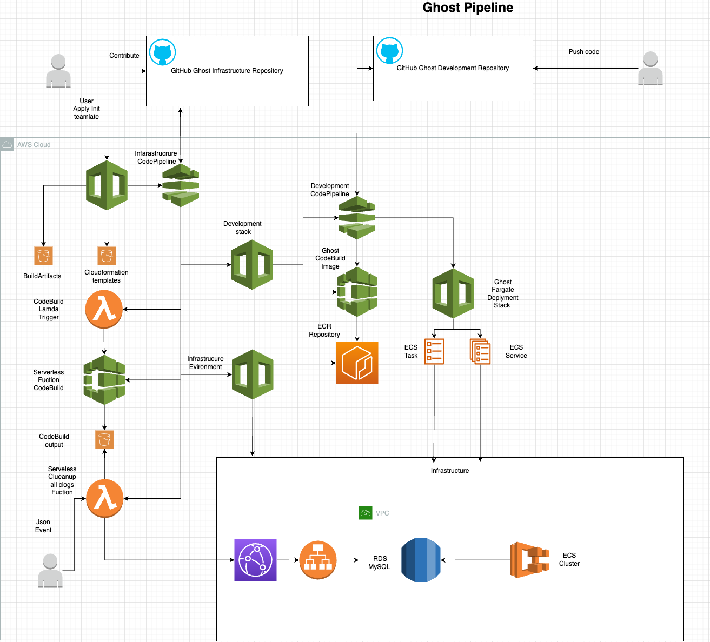

# Ghost on AWS Fargate using CloudFormation

---

### Description

This repository contains CloudFormation templates and configuration to deploy a Ghost blog on AWS Fargate. The deployment involves creating necessary infrastructure, services, and serverless functions using AWS services like ECS, RDS, Lambda, and CloudFront.

## Table of Contents

- [Prerequisites](#prerequisites)
- [Architecture](#architecture)
  - [Architecture decisions](#architecture-decisions)
  - [Project Folder tree](#project-folder-tree)
  - [Ghost Init all stack](#ghost-init-all-stack)
  - [Infrastructure stack](#infrastructure-stack)
  - [Infrastructure dependecies stack (ALDB)](#infrastructure-dependecies-stack-aldb)
  - [CodeBuildCodePipeline stack (CBCP)](#codebuildcodepipeline-stack-cbcp)
  - [Ghost Fargate deployment](#ghost-fargate-deployment)
  - [Cleanup all Ghost post python serverless fuction](#cleanup-all-ghost-post-python-serverless-fuction)
- [Init Stack parameters](#init-stack-parameters)
- [How to deploy](#how-to-deploy)
- [Recommendations](#recommendations)
- [Next steps to do](#next-steps-to-do)
- [Potential improvements](#potential-improvements)
- [Authors](#authors)

---

### Prerequisites

Before continuing, ensure you have the following prerequisites:

- DNS hosted zone stored in AWS Route 53.
- SSL Certificate stored in AWS Certificate Manager (use wildcard for multi-environments).
- GitHub user token.
- AWS key pair.
- AWS CLI and AWS account with necessary permissions.
- Ghost development repository: [ghost-development](https://github.com/olektretiak/ghost-development.git)

---

### Architecture

#### Architecture decisions:

- Ghost supports only a single instance per site, so AWS CloudFront is used for load balancing.
- AWS Proton considered but not used due to the team's lack of experience.
- Amazon ECS, RDS, and CloudFront integrated with AWS S3 are chosen.
- Infrastructure development is separate from Ghost development.

#### Project Folder tree

```
├── ghost-init-all.yaml
├── cloudformation
│   ├── ALBDB.yaml
│   ├── CPCB.yaml
│   ├── README.md
│   ├── infrastructire.yaml
│   └── vpc.yaml
├── serverless-go
│   ├── README.md
│   ├── client.go
│   ├── go.mod
│   ├── go.sum
│   ├── main.go
│   └── token.go
└── serverless-python
    ├── README.md
    ├── buildspec.yaml
    ├── fn_posts_deleteion.py
    ├── lambda-cleanup-stack.yaml
    └── lamda-build-stack.yaml
```

#### Ghost pipeline Diagram



#### Ghost Init all stack

Source: [ghost-init-all.yaml](ghost-init-all.yaml)

Description: Main Ghost project CloudFormation stack

The `ghost-init-all` CloudFormation stack creates:

1. BuildArtifactsBucket - Stores infrastructure pipeline artifacts.
2. TemplatesS3Bucket - Stores Ghost project CloudFormation templates.
3. GhostInitPipeline - Initializes CodePipeline for:
    - Lambda Build Stack to build serverless function source.
    - Ghost environments infrastructure.
    - Ghost development infrastructure.
4. GhostInitPipeline Policies and roles.
5. Admin role to Rollout Infrastructure CloudFormation Stacks.

[Continue to see details on Init Stack parameters](#init-stack-parameters)

#### Infrastructure stack

Source: [cloudformation/infrastructire.yaml](cloudformation/infrastructire.yaml)

Description: Environment infrastructure CloudFormation stack

The Infrastructure CloudFormation stack creates:
- ECS Cluster - Environment ECS cluster
- VPC stack - Networking
- ALBDB - Deploys RDS, ALB, SG, TG, CloudFront, etc.

[Continue to see details on Infrastructure stack](#infrastructure-stack)

#### Infrastructure dependecies stack (ALDB)

Source: [cloudformation/ALBDB.yaml](cloudformation/ALBDB.yaml)

Description: Infrastructure dependencies stack

The ALBDB stack creates:
- RDS secret, RDS secret kms key, MySQL RDS instance, ALB, listeners.
- Security groups, GhostTargetGroup, Route53 RecordSetGroup.
- CloudFront Distribution if selected.

[Continue to see details on Infrastructure dependencies stack (ALDB)](#infrastructure-dependecies-stack-aldb)

#### CodeBuildCodePipeline stack (CBCP)

Source: Ghost development pipelines

The CodeBuildCodePipeline stack creates:
- ECR Repository, CodePipeline Webhook, IAM roles, CodeBuild projects.
- S3 Bucket for build artifacts, Lambda function to trigger CodeBuild.
- Custom CodeBuildTrigger, CodePipeline linked to the Ghost development repository.

[Continue to see details on CodeBuildCodePipeline stack (CBCP)](#codebuildcodepipeline-stack-cbcp)

#### Ghost Fargate deployment

Description: Fargate service and task

Source: Stored in the [Ghost development repository](https://github.com/olektretiak/ghost-development/blob/main/pipelines/fargate-deployment.yaml)

The Ghost Fargate deployment creates an ECS Task and Service for Ghost.

[Continue to see details on Ghost Fargate deployment](#ghost-fargate-deployment)

#### Cleanup all Ghost post python serverless function

Serverless function to cleanup posts via the Ghost API

[Continue to see details on Cleanup all Ghost post python serverless function](#cleanup-all-ghost-post-python-serverless-fuction)

---

### Init Stack parameters

Details of parameters required for the `ghost-init-all` stack:

1. BuildArtifactBucketName: Name for the S3 bucket to store infrastructure pipeline artifacts.
2. TemplatesS3BucketName: Name for the S3 bucket to store Ghost project CloudFormation templates.
3. GitHubToken: GitHub user token

 for source control integration.
4. StageEnvironment: Set to true to create a stage environment.
5. ProductionEnvironment: Set to true to create a production environment.
6. DefaultRegion: Default AWS region for the stack.
7. GhostRepoUrl: URL of the Ghost development repository.

---

### How to deploy

The best way is to go to the AWS console to upload the template [ghost-init-all.yaml](ghost-init-all.yaml) as it has many variables.

Some important information to read before applying the template:
1. By default, it will roll out the development infrastructure. If you want to deploy to Stage or Production, make sure to select the corresponding options.
2. Make sure to select the correct DB allocation, class, and instance size.
3. DBMultiAZ is enabled only for the production environment.

---

### Recommendations

- Implement AWS WAF and AWS Shield for production. <span style="color:red">DO NOT APPLY IT FOR TESTING</span>

---

### Next steps to do

- Integrate secure image storage into Ghost using Amazon S3 with a custom storage adapter.
- Restrict permissions for InfraExecutionRole (currently uses 'arn:aws:iam::aws:policy/AdministratorAccess').
- Implement git branching strategy for repositories and CI/CD.
- Move production deployment to a separate AWS account.
- Implement AWS Multi-Region ECS Cluster and RDS read replica for disaster recovery.

---

### Potential improvements

- Implement RDS Multi-Region backup for disaster recovery.
- Add IAM auth to RDS and implement secret rotation.
- Switch to AWS Secrets Manager for secrets management.
- Tune AWS CloudFront parameters and configure logs.

---

### Authors

Oleksandr Tretiak

---
